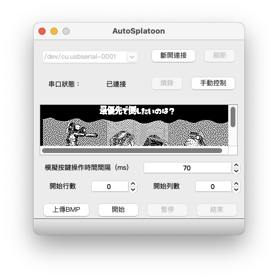
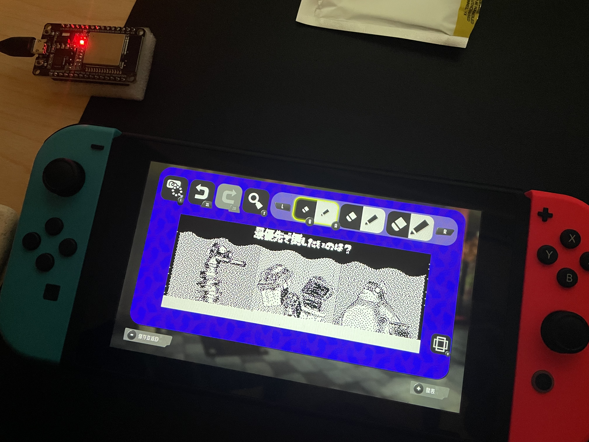

# AutoSplatoon for macOS

基於 [AutoSplatoon for Windows](https://github.com/amowu/AutoSplatoon)

## 軟體界面

## 實機效果

（圖片來源：<a href="https://www.pixiv.net/artworks/101567519">pixiv ricco</a>）

## 支持硬體

ESP32 系列，e.g. ESP32 WROOM 模组、ESP32 WROVER 模组、ESP32 PICO V3 芯片、ESP32 PICO D4 芯片...

## 使用教程

前往 [GitHub Releases](https://github.com/amowu/AutoSplatoon/releases) 下載最新版本的 AutoSplatoon.app.zip，解壓縮之後執行 AutoSplatoon。

其它操作詳見 B 站 [【斯普拉遁】广场涂鸦自动化工具！保姆级教程](https://www.bilibili.com/video/BV1va411R7TJ?vd_source=08b359f4e68b47a7ff089bcfa5caa191)

## FAQ

### 如何在 macOS 上開發這個專案？

1. 下載安裝 [Qt Creator](https://www.qt.io/product/development-tools)
2. 安裝過程勾選 5.x.x 版本，並且記得勾選 macOS 選項
3. 打開 AutoSplatoon/AutoSplatoon.pro
4. 執行 build（建置）
5. 執行完成應該會產生類似 build-AutoSplatoon-Desktop_Qt_5_15_2_clang_64bit-Debug 的資料夾
6. 在 AutoSplatoon 右鍵 > 顯示套件內容
7. 將 resource/esptool.py 和 resource/PRO-UART0.bin 拷貝一份到 Contents > MacOS 底下
8. 執行程式

### 如何得知 ESP32 的端口？

1. 打開 Terminal
2. 執行 `pip install esptool` or `pip3 install esptool`
3. 執行 `esptool.py read_mac` 會列出一堆資訊，其中 `Serial port` 就是你要找的端口
